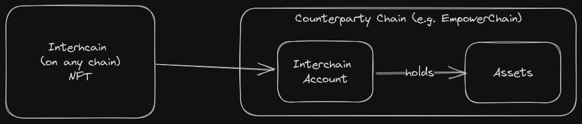
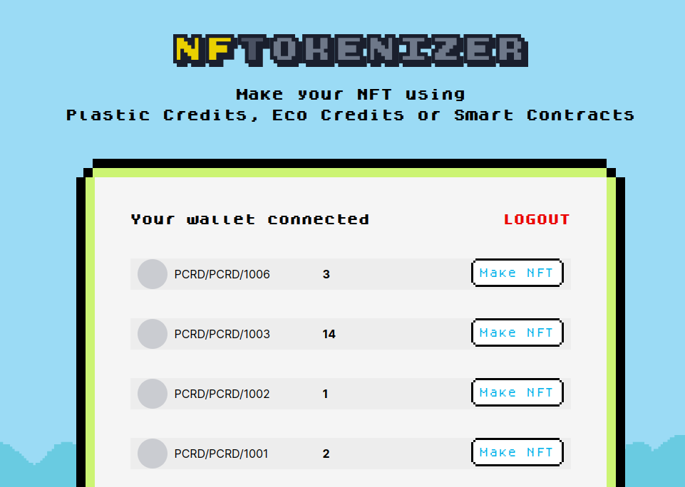
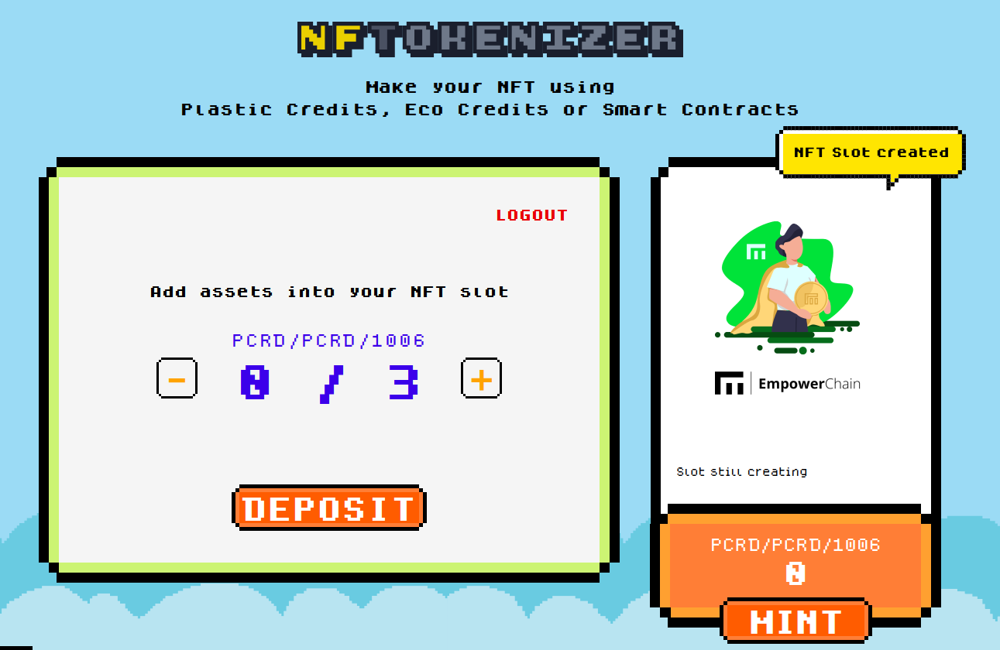
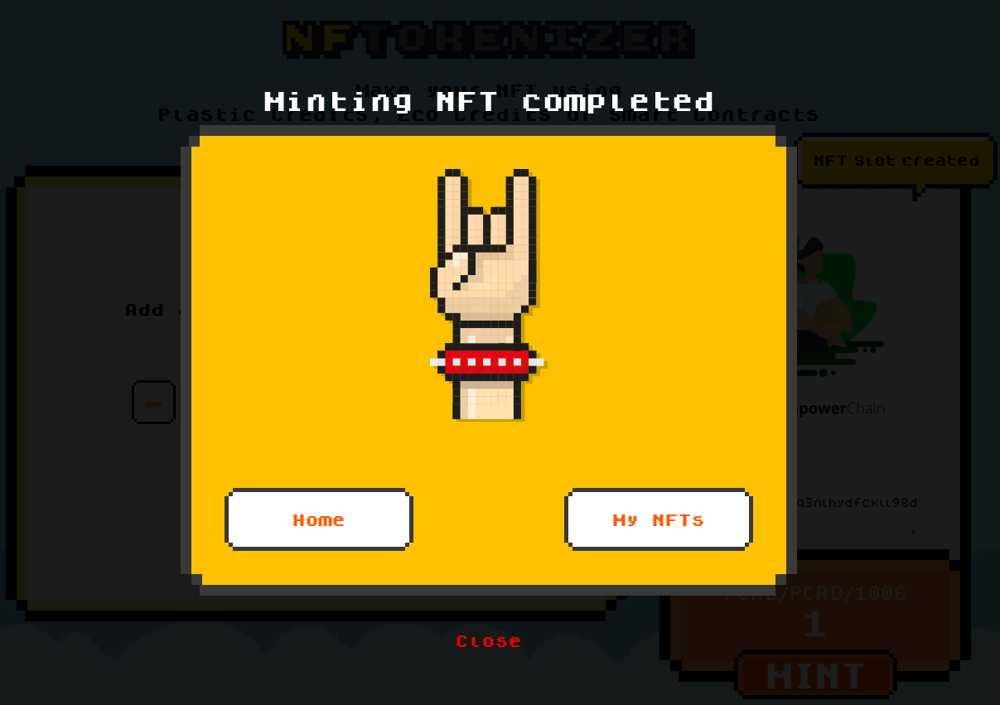
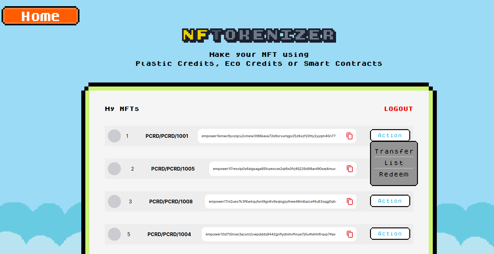
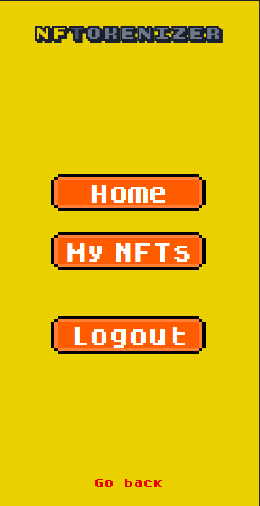
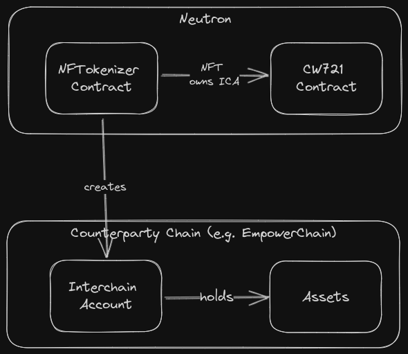
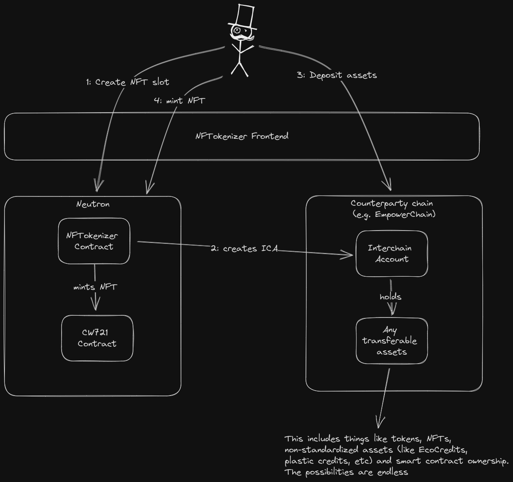

# nftokenizer

A Game of NFTs project by EmpowerChain.

Tokenize any asset, cross-chain, into an NFT use it in any way you could an NFT (DeFi, games, access control, etc).

A video demo can be found here: https://www.youtube.com/watch?v=fow_uQqEak4

## What has been built:

### NFTokenizer contract
You can find the contract code in the `cosmwasm` folder. It uses Neutron's SDK
to create interchain accounts (https://docs.neutron.org/neutron/modules/interchain-txs/overview) 
and implements the sudo callback from Neutron's SDK to allow the contract to 
find the interchain account address.

Deployed NFTokenizer contract address: neutron1zkjxwed2kr6eu46hztheeqjkgmntkacd6tadteqwqk9l04x3gmjq4maq32

You can interact directly with the contract on Celatone: https://neutron.celat.one/testnet/query?contract=neutron1zkjxwed2kr6eu46hztheeqjkgmntkacd6tadteqwqk9l04x3gmjq4maq32

The CW721 contract deployed for the hackathon is here: https://neutron.celat.one/testnet/query?contract=neutron1qpdj87vl4sl9uwkzald6afawvulu6whun69fxmrcr0xp4khdlzyqf4jj94

### NFTokenizer frontend
A playful and easy-to-use UI has been developed to let anyone use the contract easily.
It abstracts away a lot of these concepts to make it straightforward to create and mint NFTs.

You can find a deployed version here: https://nftokenizer.vercel.app/

The frontend has also been developed to support mobile screens (but has not implemented mobile wallet support _yet_, sorry)

## High level concept

The idea is to utilize the Interchain acocunt standard to create NFTs that are 
effectively the ownership of an asset on another chain. This is done by creating
an interchain account that is owned by the NFTokenizer contract and deposited into
by the creator of the NFT.

The flow is as follows:
1. The user creates an "NFT Slot" which represents the NFT to be created
2. The smart contract, as part of creating the NFT slot, creates an interchain account on the counterparty chain
3. The user deposits any assets they want to tokenize into the interchain account
    - Since the holder is just an account this can be anything that is transferable such as tokens, nfts, contract admin privileges, non-standardizes assets, etc.
4. The user mints an NFT which is effectively the ownership of the interchain account

## Future work
The main missing feature is the redeem functionality. 
This would allow the user to burn the NFT and withdraw the assets from the interchain account.

This should not be a big deal since Neutron supports ICA transactions. There was just not enough
time to finish all of this by the end of the deadline. 

Other smaller things that will be fixed later:
- Support other chain assets (on any chain that supports IBC)
- Generic flow that allows the user to deposit any asset into the interchain account
- Combine NFT Slot creation with NFT minting action (so the user doesn't have to make two transactions to create an NFT)
- Allow transfer of NFT from the UI itself (it is supported from any other NFT UI since the NFTs are standard CW721)

## Build instructions

### Frontend

The frontend code can be found under the `nftokenizer-frontend` folder.

Build and run instructions can be found in the `nftokenizer-frontend/README.md` file.

### Smart contract
The smart contract code can be found under the `cosmwasm` folder.

The smart contract can be built using `cargo build` or if you install Earthly (https://earthly.dev/) 
you can use `earthly +build` and `earthly -P +build-optimized` to build the contract. 

