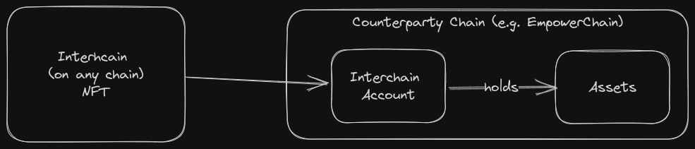
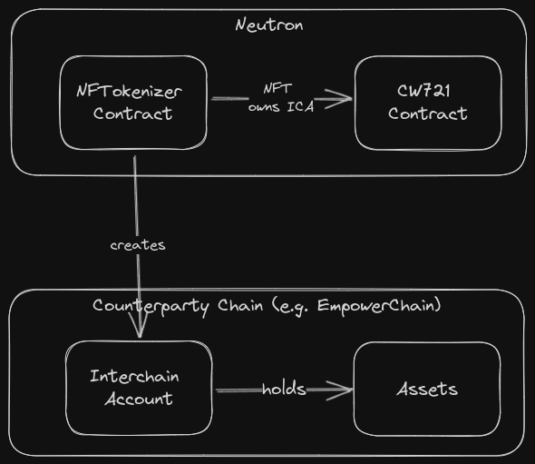

# nfttokenizer contract

This is the nfttokenizer contract. It implements a contract that allows users to create NFTs that are effectively
the ownership of an asset on another chain. This is done by creating an interchain account that is owned by the NFTokenizer contract and deposited into
by the creator of the NFT.

Deployed NFTokenizer contract address: neutron1zkjxwed2kr6eu46hztheeqjkgmntkacd6tadteqwqk9l04x3gmjq4maq32

You can interact directly with the contract on Celatone: https://neutron.celat.one/testnet/query?contract=neutron1zkjxwed2kr6eu46hztheeqjkgmntkacd6tadteqwqk9l04x3gmjq4maq32

The CW721 contract deployed for the hackathon is here: https://neutron.celat.one/testnet/query?contract=neutron1qpdj87vl4sl9uwkzald6afawvulu6whun69fxmrcr0xp4khdlzyqf4jj94

## Implementation

The contract uses Neutron's implementation of interchain accounts (https://docs.neutron.org/neutron/modules/interchain-txs/overview)
which features the current big lack in ICA: callbacks. The callback is implemented in `src/sudo.rs` and
uses CosmWasm's sudo entry point to allow the callback from Neutron's custom module (by accepting the `SudoMsg::OpenAck` message).

The contract is fairly simple as far as state changes go. During instantiation, it takes a CW721 code id and 
instantiates the CW721 contract.

The contract uses a concept coined "NFT Slots" which are essentially a placeholder for an NFT with an ICA account attached.
When someone calls `create_nft_slot` the contract creates an ICA account and stores the slot in the contract state.

When someone calls `mint_nft` the contract mints a CW721 token to the caller.

## Future work

- It would be nice to combine create_nft_slot and mint_nft into a single call
- The contract should implement a `redeem` function to allow the user to burn the NFT and withdraw the assets from the ICA account
- Tests, obviously